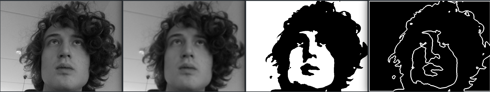

# Scope face
Showing a webcam feed on a oscilloscope screen by converting it to terrible sound.

This is done by finding the contours in the image, converting the x, y coordinates of these contours
to the left and right signals of a "sound" signal and (preferably without listening to it) feeding it to a oscilloscope in XY mode.

Image processing looks like this:

And resulting video:
